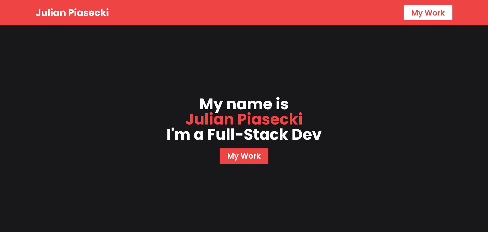

# 🚀 Portfolio


This is Julian Piasecki's personal website where he showcases his projects and skills. 🚀



## 🔗 Links

- [Live Demo](https://julian-portfolio.vercel.app)

## 📐 Tech Stack

- Next.js
- Typescript
- Sanity
- Tailwind CSS
- React Icons

## ✨ Usage

```bash
git clone https://github.com/piaseckijulian/Portfolio.git
cd Portfolio
pnpm dev
```

Next, duplicate the .env.example file, rename the duplicate to .env, and then input your environmental variables there.

Then, go to `/studio` page of your Portfolio and add your data.

That's it! - You're good to go. You can add new features, fix bugs etc.

## 🌐 Contribution

If you want to contribute to this amazing project simply raise an **Issue** when you found a bug or you are requesting a new feature. However if you want to do it yourself create a **Pull Request**.
