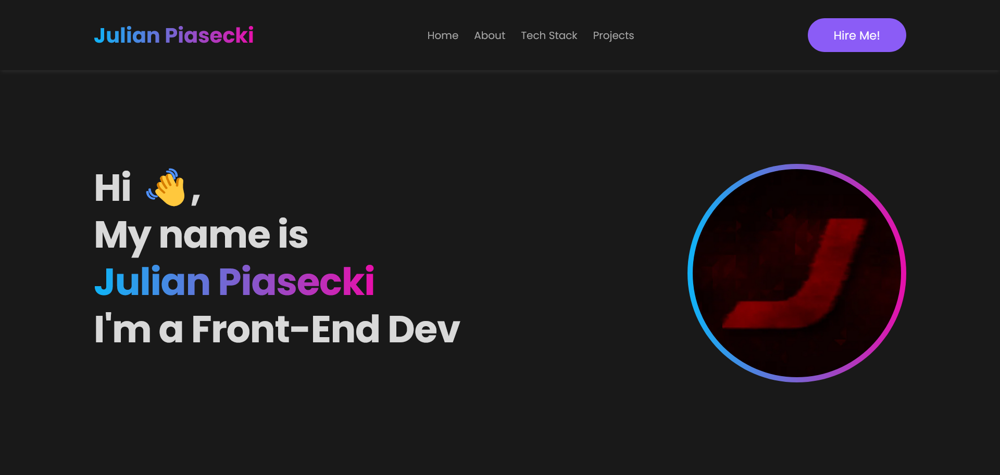

# Portfolio - 🚀Julian Piasecki's Portfolio Website

This is my personal website when I showcase my projects and my skills

# Image

 

# About

I built this project with:

- [Next.js](https://www.npmjs.com/package/next)
- [Typescript](https://www.npmjs.com/package/typescript)
- [Tailwind CSS](https://www.npmjs.com/package/tailwindcss)
- [Sanity](https://www.npmjs.com/package/sanity)
- [React Icons](https://www.npmjs.com/package/react-icons)

# [Live Demo](https://julian-portfolio.vercel.app)
