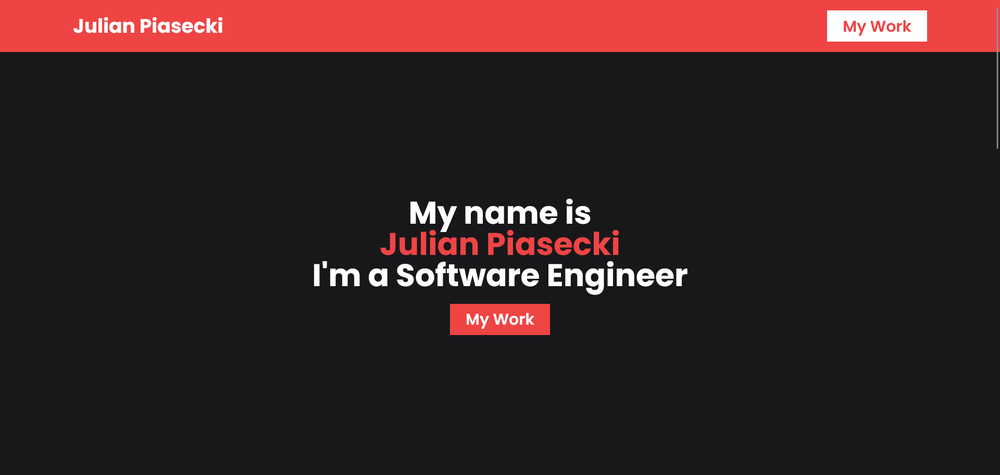

# 🚀 Portfolio


Explore Julian Piasecki's personal website to discover an impressive showcase of his diverse programming projects and exceptional skills in the world of technology. 🚀



## 🔗 Links

- [Live Demo](https://julian-portfolio.vercel.app)

## 📐 Tech Stack

- Next.js
- TypeScript
- Sanity
- Tailwind CSS
- React Icons

## ✨ Usage

```bash
git clone https://github.com/piaseckijulian/Portfolio.git
cd Portfolio
pnpm dev
```

Next, duplicate the `!.env.example` file, rename the duplicate to `.env`, and then input your environmental variables there.

Then, go to `/studio` page of your Portfolio and add your data.

That's it! - You're good to go. You can add new features, fix bugs etc.

## 🌐 License

This software is licensed under the [MIT License](https://github.com/piaseckijulian/Portfolio/blob/main/LICENSE)
